# Инструкция по использованию системы локального прокторинга

## Установка расширения в Google Chrome

1. Откройте раздел "Управление расширениями" в браузере.

    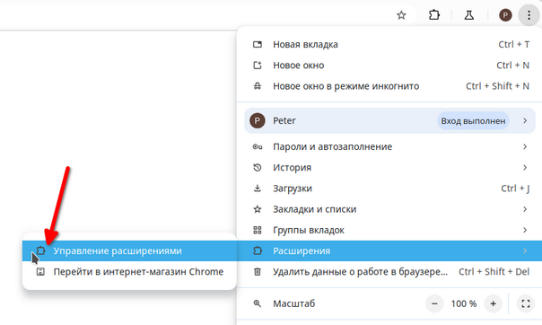

2. Активируйте режим разработчика.

    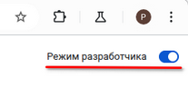

3. Нажмите "Load unpacked" (Загрузить распакованное расширение) и выберите папку `mse1h2025-prctr/client`

    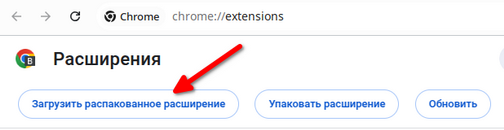

4. Для удобства закрепите расширение на панели инструментов.

    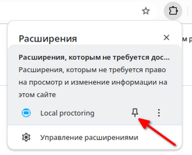

## Работа с клиентской частью расширения
### 1. Интерфейс popup-расширения

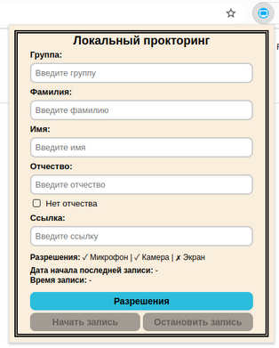

- Поля:
 - Группа
 - Фамилия
 - Имя
 - Отчество
 - Ссылка на экзаменационную "комнату".
- Чекбокс для пользователей без Отчества
- Информация о текущих статусах разрешений (✓ – предоставлено, ✗ – не предоставлено):
  - Микрофон
  - Камера
  - Экран
- Дата начала последней записи
- Время записи
- Кнопки:
  - Разрешения – запрашивает доступ к необходимым разрешениям
  - Начать запись – начинает записи
  - Остановить запись – заканчивает записи, сохраняя их у пользователя локально

### 2. Заполнение данных

В форме необходимо указать:
- **Группа**: ровно 4 цифры (например, `1234`).
- **Фамилия, Имя, Отчество**: должны начинаться с заглавной буквы и содержать только русские/латинские буквы и тире (например, `Иванов` или `Albus-Severus`). 
- **Ссылка на экзаменационную "комнату"**: поле не должно быть пустым.

    

Примечания:
- Система автоматически проверяет корректность ввода и предоставляет подсказки при ошибках.
    - Ошибки:
    
        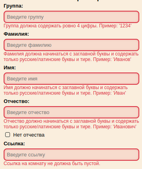
    
    - Подсказки:
    
        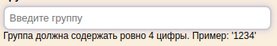

### 3. Настройка разрешений
1. Нажмите кнопку **"Разрешения"** для перехода в системную вкладку расширения.
Система уведомляет о необходимости предоставления разрешений, а также просит не прерывать их для корректной работы приложения.

    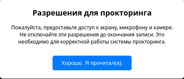

2. Нажав на кнопку "Хорошо. Я прочитал(а).", система предложит выдать разрешение на запись экрана:

    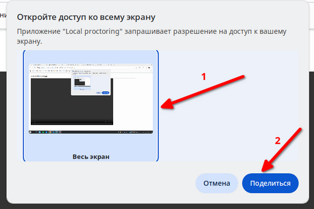

    ### Прерывание записи
    При отмене предоставления доступа к экрану система сообщит, об отмене разрешения для экрана:

    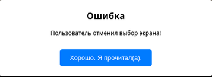

    Повторно нажмите **"Разрешения"**.

3. После предоставления экрана система попросит выдать разрешение на использование микрофона и камеры. 
- "Разрешить в этот раз". Расширение будет запрашивать у Вас разрешение каждый раз при записи. 
- "Разрешить при нахождении на сайте". Вы соглашаетесь с тем, что расширение всегда использует либо микрофон, либо камеру. 
 
    

    ### Прерывание записи

    При запрете разрешений на использование микрофона и камеры система сообщит, что доступ к микрофону или камере запрещен:

    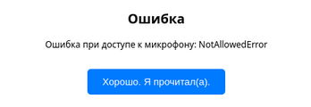 

 

    После чего система попросит убедиться, что доступ к микрофону и камере разрешены.

    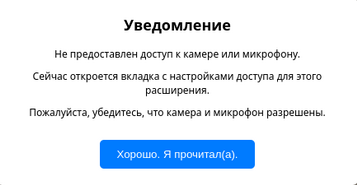

    Нажав на кнопку "Хорошо. Я прочитал(а)."), система закроет системную вкладку расширения и перенаправит Вас на вкладку настроек безопасности расширения. Для камеры и микрофона необходимо поменять статус "Блокировать" на "Разрешить" или "Спрашивать (по умолчанию)". 

    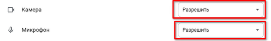

    Примечание:
    - В случае со статусом "Спрашивать (по умолчанию)" расширение будет запрашивать у Вас разрешение каждый раз при записи.

    Повторно нажмите **"Разрешения"**.

4. После выдачи всех разрешений система сообщит о готовности к записи с небольшой информацией о работе расширения.

    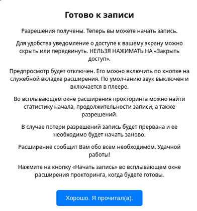
    
    Также на вкладке появится предпросмотр: экрана и камеры.

    ### Прерывание записи
    Если закрыть доступ к экрану, камере или микрофону после предоставления разрешений, то система уведомит о том, что соответствующее разрешение было заблокировано и нужно повторно нажать кнопку "Разрешения" после предоставления недостающих разрешений.

    
    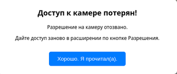
    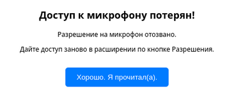

### 4. Начало записи

1. Нажмите кнопку **"Начать запись"**. Система:
- Запустит запись.
- Отключит предпросмотр.
- Уведомит о начале процесса.

    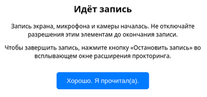

2. Во время записи можно можно включить и выключить предпросмотр через системную вкладку.
 
    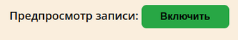
    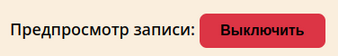

    ### Прерывание записи

    При отзыве разрешений во время записи:
    1. Система уведомит о блокировке доступа попросит выдать разрешения и начать запись заново.
    2. Нажмите **"Хорошо. Я согласен(а)."** для остановки записи.
    3. Файлы сохранятся в папку **Загрузки (Downloads)**. Система предоставит статистику:
    - Начало записи
    - Конец записи
    - Длительность записи
    - Куда сохранены файлы записи экрана и камеры
    - Название файла записи экрана (его размер)
    - Название файла записи камеры (его размер):
    - Куда сохранен файл логов

        

#### Конец записи
1. Нажмите "Остановить запись".
2. Записи остановятся и сохранятся в папку **Загрузки (Downloads)**.
3. Система предоставит статистику:
- Начало записи
- Конец записи
- Длительность записи
- Куда сохранены файлы записи экрана и камеры
- Название файла записи экрана (его размер)
- Название файла записи камеры (его размер):
- Куда сохранен файл логов